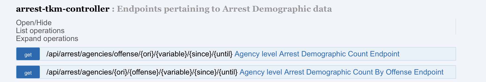

# Domain Specific

The package is specifically created for domain pulls that need to be customizable and cater to the domain.

**Application Arguments**

| Argument        | Sample           | Required  |
| ------------- |:-------------:| -----:|
| API Endpoint | https://api.usa.gov/crime/fbi/sapi | Yes  |
| API Key | secret key to access API | Yes  |
| Outpath | landing s3 directory of data i.e. s3://campaign-zero/cde/| Yes  |

Summary
-        

When building pipelines sometimes domains are a little more complex and need to have something written specifically for its own purpose without using the same reoccurring patterns with some default models. 

In this particular use case getting data from the [crime data explorer](https://crime-data-explorer.fr.cloud.gov/) domain needed a pipeline more domain specific to ingest. 

**Details**

 - Git: https://github.com/fbi-cde/crime-data-frontend/blob/master/README.md
 - API Base URL: https://api.usa.gov/crime/fbi/sapi
 - API Endpoints: https://crime-data-explorer.fr.cloud.gov/api

 Pipeline Endpoints: Refer to the links for documentation and request parameters. 

**[Package Location](../src/main/scala/com/sg/transformers/dsl)**

 - [**CDE Class**](../src/main/scala/com/sg/transformers/dsl/CDE.scala): Pipeline class that pulls the data into the wanted directory. 

